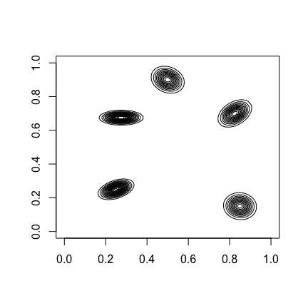
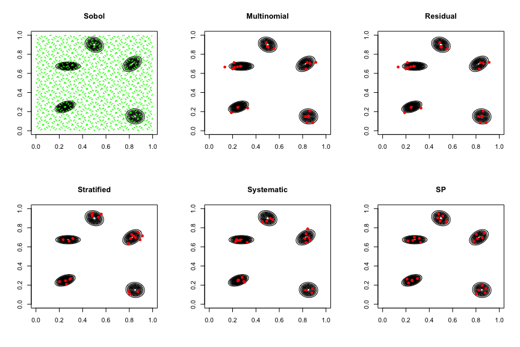
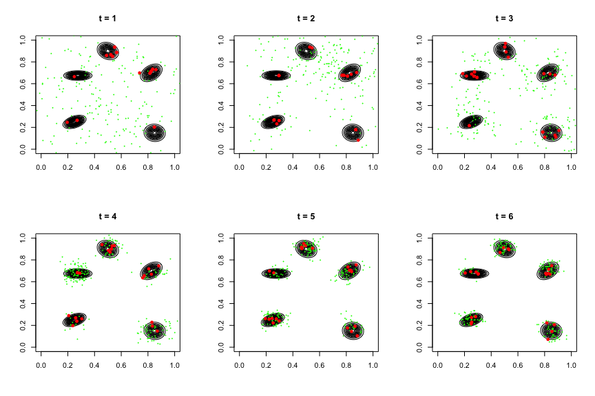
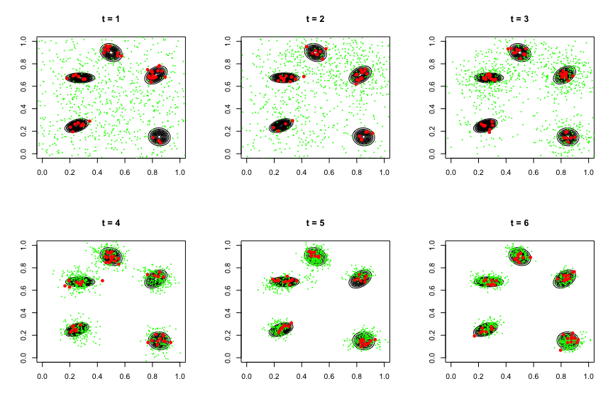
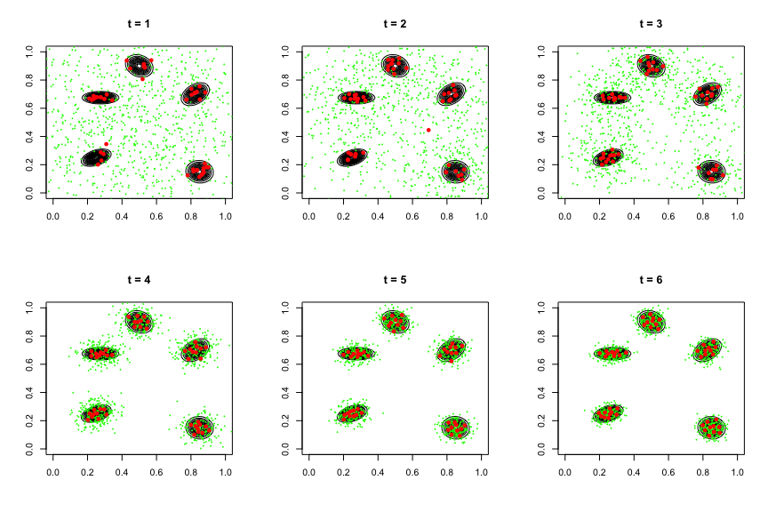

Improving PMC Using Support Points
================
Chaofan (Bill) Huang

Let us first load the required libraries and scripts.

``` r
set.seed(950922)
source("scripts/lib.R")
library(mvtnorm)
library(randtoolbox)
```

Now define the log density for the two dimensional mixture of five
normals.

``` r
logmixture <- function(x){
  v <- matrix(NA, nrow = 5, ncol = 2)
  v[1,] <- c(-10,-10)
  v[2,] <- c(0,16)
  v[3,] <- c(13,8)
  v[4,] <- c(-9,7)
  v[5,] <- c(14,-14)
  v <- (v + 20) / 40
  sigma <- array(NA, dim = c(5,2,2))
  sigma[1,,] <- matrix(c(2,0.6,0.6,1), nrow = 2) / 40^2
  sigma[2,,] <- matrix(c(2,-0.4,-0.4,2), nrow = 2) / 40^2
  sigma[3,,] <- matrix(c(2,0.8,0.8,2), nrow = 2) / 40^2
  sigma[4,,] <- matrix(c(3,0,0,0.5), nrow = 2) / 40^2
  sigma[5,,] <- matrix(c(2,-0.1,-0.1,2), nrow = 2) / 40^2
  logf <- rep(0,5)
  for (i in 1:5) logf[i] <- dmvnorm(x, mean = v[i,], sigma = sigma[i,,], log = T)
  logf <- logaddexp(logf) - log(5)
  return (logf)
}
```

Let us draw the density contour of the mixture distribution.

``` r
x1 <- x2 <- seq(0, 1, length.out = 101)
x.grid <- expand.grid(x1, x2)
density <- matrix(exp(apply(x.grid, 1, logmixture)), 101, 101)
contour.default(x = x1, y = x2, z = density, drawlabels = F, nlevels = 15)
```

<!-- -->

## Resampling Method Comparsion

Consider resmaple n = 100 points from 2500 Sobol points over the unit
square as importance samples for the mixture of normals using
Multinomial, Residual, Stratified, Systematic, and Support Points.

``` r
n <- 50
N <- 2500
layout(matrix(c(1:6), nrow = 2, byrow = T))
# Sobol points
samp <- sobol(N, 2)
contour.default(x = x1, y = x2, z = density, drawlabels = F, nlevels = 15, main = "Sobol")
points(samp, pch = 18, cex = 0.5, col = "green")
# compute the weight
samp.logwts <- apply(samp, 1, logmixture)
samp.wts <- exp(samp.logwts - max(samp.logwts))
samp.wts <- samp.wts / sum(samp.wts)
# Multinomial resampling
mn.samp <- samp[sample(1:N, n, replace=T, prob=samp.wts),]
contour.default(x = x1, y = x2, z = density, drawlabels = F, nlevels = 15, main = "Multinomial")
points(mn.samp, pch = 16, cex = 1, col = "red")
# Residual resampling
rs.samp <- samp[rs.sample(1:N, n, prob=samp.wts),]
contour.default(x = x1, y = x2, z = density, drawlabels = F, nlevels = 15, main = "Residual")
points(mn.samp, pch = 16, cex = 1, col = "red")
# Stratified resampling
st.samp <- samp[st.sample(1:N, n, prob=samp.wts),]
contour.default(x = x1, y = x2, z = density, drawlabels = F, nlevels = 15, main = "Stratified")
points(st.samp, pch = 16, cex = 1, col = "red")
# Systematic resampling
ss.samp <- samp[ss.sample(1:N, n, prob=samp.wts),]
contour.default(x = x1, y = x2, z = density, drawlabels = F, nlevels = 15, main = "Systematic")
points(ss.samp, pch = 16, cex = 1, col = "red")
# Support Points resampling
sp.samp <- samp[sp.sample(samp, n, prob=samp.wts),]
contour.default(x = x1, y = x2, z = density, drawlabels = F, nlevels = 15, main = "SP")
points(sp.samp, pch = 16, cex = 1, col = "red")
```

<!-- -->

## PQMC vs. PMC

Let us now run PMC and PQMC on the mixture of five normals with N = 50,
J = 20, and T = 6. The initial centers are the 50 Sobol points over the
unit square. Adaptation for covariance is applied. Here follows the
parameter setting.

``` r
expectation <- 0.5 + c(1.6,1.4) / 40 # E[X]
Z <- 1 # normalizing constant
p <- 2 # dimensions
N <- 50 # number of propopsals
J <- 20 # number of samples drawn from each proposal
steps <- 6 # number of PMC iterations
ini <- sobol(N, p) # initial centers
sigma <- 0.2 # initial covariance
adaptation <- T # adaptation for covariance
```

### PMC (Multinomial)

``` r
layout(matrix(c(1:6), nrow = 2, byrow = T))
pmc.mn <- pmc(ini, logmixture, J, steps, sigma, resample = "Multinomial",
              sigma.adapt = adaptation, qmc = F, visualization = T)
```

<!-- -->

``` r
# log MSE of E[X] by standard PMC estimator
log(mean((pmc.mn$m.std - expectation)^2))
```

    ## [1] -10.01061

``` r
# log MSE of E[X] by weighted PMC estimator
log(mean((pmc.mn$m.wts - expectation)^2))
```

    ## [1] -11.76628

``` r
# log MSE of Z by standard PMC estimator
log((pmc.mn$z.std - Z)^2)
```

    ## [1] -7.955113

``` r
# log MSE of Z by weighted PMC estimator
log((pmc.mn$z.wts - Z)^2)
```

    ## [1] -11.97185

### PMC (Systematic)

``` r
layout(matrix(c(1:6), nrow = 2, byrow = T))
pmc.ss <- pmc(ini, logmixture, J, steps, sigma, resample = "Systematic",
              sigma.adapt = adaptation, qmc = F, visualization = T)
```

<!-- -->

``` r
# log MSE of E[X] by standard PMC estimator
log(mean((pmc.ss$m.std - expectation)^2))
```

    ## [1] -10.38251

``` r
# log MSE of E[X] by weighted PMC estimator
log(mean((pmc.ss$m.wts - expectation)^2))
```

    ## [1] -11.5296

``` r
# log MSE of Z by standard PMC estimator
log((pmc.ss$z.std - Z)^2)
```

    ## [1] -7.803806

``` r
# log MSE of Z by weighted PMC estimator
log((pmc.ss$z.wts - Z)^2)
```

    ## [1] -9.693227

### PQMC (Support Points)

``` r
layout(matrix(c(1:6), nrow = 2, byrow = T))
pmc.sp <- pmc(ini, logmixture, J, steps, sigma, resample = "SP",
              sigma.adapt = adaptation, qmc = T, visualization = T)
```

<!-- -->

``` r
# log MSE of E[X] by standard PMC estimator
log(mean((pmc.sp$m.std - expectation)^2))
```

    ## [1] -13.39367

``` r
# log MSE of E[X] by weighted PMC estimator
log(mean((pmc.sp$m.wts - expectation)^2))
```

    ## [1] -12.72614

``` r
# log MSE of Z by standard PMC estimator
log((pmc.sp$z.std - Z)^2)
```

    ## [1] -8.226449

``` r
# log MSE of Z by weighted PMC estimator
log((pmc.sp$z.wts - Z)^2)
```

    ## [1] -9.391523
