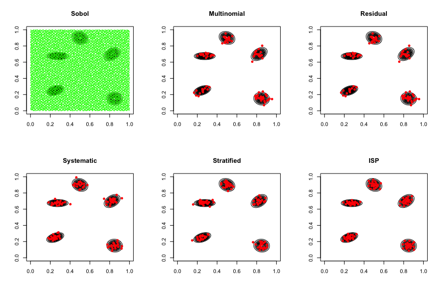
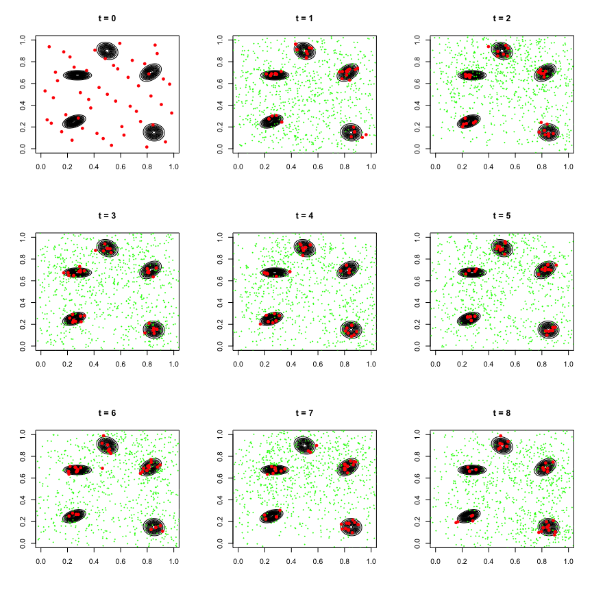

Population Quasi-Monte Carlo
================
Chaofan (Bill) Huang

Let us first load the required libraries and scripts.

``` r
set.seed(20210816)
source("scripts/lib.R")
library(mvtnorm)
library(randtoolbox)
```

Now define the log density for the two dimensional mixture of five
normals.

``` r
logmixture <- function(x){
  v <- matrix(NA, nrow = 5, ncol = 2)
  v[1,] <- c(-10,-10)
  v[2,] <- c(0,16)
  v[3,] <- c(13,8)
  v[4,] <- c(-9,7)
  v[5,] <- c(14,-14)
  v <- (v + 20) / 40
  sigma <- array(NA, dim = c(5,2,2))
  sigma[1,,] <- matrix(c(2,0.6,0.6,1), nrow = 2) / 40^2
  sigma[2,,] <- matrix(c(2,-0.4,-0.4,2), nrow = 2) / 40^2
  sigma[3,,] <- matrix(c(2,0.8,0.8,2), nrow = 2) / 40^2
  sigma[4,,] <- matrix(c(3,0,0,0.5), nrow = 2) / 40^2
  sigma[5,,] <- matrix(c(2,-0.1,-0.1,2), nrow = 2) / 40^2
  logf <- rep(0,5)
  for (i in 1:5) logf[i] <- dmvnorm(x, mean = v[i,], sigma = sigma[i,,], log = T)
  logf <- logaddexp(logf) - log(5)
  return (logf)
}
```

Let us draw the density contour of the mixture distribution.

``` r
x1 <- x2 <- seq(0, 1, length.out = 101)
x.grid <- expand.grid(x1, x2)
density <- matrix(exp(apply(x.grid, 1, logmixture)), 101, 101)
contour.default(x = x1, y = x2, z = density, drawlabels = F, nlevels = 15)
```

<!-- -->

## Resampling Method Comparsion

Consider resmaple n = 100 points from 10000 Sobol points over the unit
square as importance samples for the mixture of normals using
multinomial, residual, Hilbert curve sorted systematic, Hilbert curve
sorted stratified, and importance support points (ISP).

``` r
n <- 100
N <- 10000
layout(matrix(c(1:6), nrow = 2, byrow = T))
# Sobol points
samp <- sobol(N, 2)
contour.default(x = x1, y = x2, z = density, drawlabels = F, nlevels = 15, main = "Sobol")
points(samp, pch = 18, cex = 0.5, col = "green")
# compute the weight
samp.logwts <- apply(samp, 1, logmixture)
samp.wts <- exp(samp.logwts - max(samp.logwts))
samp.wts <- samp.wts / sum(samp.wts)
# multinomial resampling
mn.samp <- samp[mn.sample(samp, n, prob=samp.wts),]
contour.default(x = x1, y = x2, z = density, drawlabels = F, nlevels = 15, main = "Multinomial")
points(mn.samp, pch = 16, cex = 1, col = "red")
# residual resampling
rs.samp <- samp[rs.sample(samp, n, prob=samp.wts),]
contour.default(x = x1, y = x2, z = density, drawlabels = F, nlevels = 15, main = "Residual")
points(mn.samp, pch = 16, cex = 1, col = "red")
# Hilbert curve sorted systematic resampling
ss.samp <- samp[ss.sample(samp, n, prob=samp.wts),]
contour.default(x = x1, y = x2, z = density, drawlabels = F, nlevels = 15, main = "Systematic")
points(ss.samp, pch = 16, cex = 1, col = "red")
# Hilbert curve sorted stratified resampling
st.samp <- samp[st.sample(samp, n, prob=samp.wts),]
contour.default(x = x1, y = x2, z = density, drawlabels = F, nlevels = 15, main = "Stratified")
points(st.samp, pch = 16, cex = 1, col = "red")
# Importance Support Points (ISP) resampling
isp.samp <- samp[sp.sample(samp, n, prob=samp.wts),]
contour.default(x = x1, y = x2, z = density, drawlabels = F, nlevels = 15, main = "ISP")
points(isp.samp, pch = 16, cex = 1, col = "red")
```

<!-- -->

## PQMC vs. PMC on Mixture of Normals

Let us now run PMC and PQMC on the mixture of five normals with K = 50,
J = 20, and T = 8. The initial centers are the 50 Sobol points over the
unit square. Adaptation for covariance is applied for PQMC only. Here
follows the parameter setting.

``` r
expectation <- 0.5 + c(1.6,1.4) / 40 # E[X]
Z <- 1 # normalizing constant
p <- 2 # dimensions
K <- 50 # number of propopsals
J <- 20 # number of samples drawn from each proposal
steps <- 8 # number of PMC iterations
# initilization
ini <- sobol(K, p) # initial centers
# initial covariance
sigma <- 0.2 # initial covariance
```

### PMC (Multinomial)

``` r
# setting
sampling <- "random"
resampling <- "multinomial"
sigma.adapt <- FALSE
# call pmc function
layout(matrix(c(1:9), nrow = 3, byrow = T))
pmc.mn <- pmc(logmixture, K, J, steps, ini, 
              sampling = sampling, resampling = resampling, 
              sigma = sigma, sigma.adapt = sigma.adapt,
              visualization = T)
```

<!-- -->

``` r
# log MSE of E[X] by standard PMC estimator
log(mean((pmc.mn$m.std - expectation)^2))
```

    ## [1] -7.954263

``` r
# log MSE of E[X] by weighted PMC estimator
log(mean((pmc.mn$m.wts - expectation)^2))
```

    ## [1] -8.002563

``` r
# log MSE of Z by standard PMC estimator
log((pmc.mn$z.std - Z)^2)
```

    ## [1] -6.40841

``` r
# log MSE of Z by weighted PMC estimator
log((pmc.mn$z.wts - Z)^2)
```

    ## [1] -7.463829

### PMC (Residual)

``` r
# setting
sampling <- "random"
resampling <- "residual"
sigma.adapt <- FALSE
# call pmc function
layout(matrix(c(1:9), nrow = 3, byrow = T))
pmc.rs <- pmc(logmixture, K, J, steps, ini, 
              sampling = sampling, resampling = resampling, 
              sigma = sigma, sigma.adapt = sigma.adapt,
              visualization = T)
```

<!-- -->

``` r
# log MSE of E[X] by standard PMC estimator
log(mean((pmc.rs$m.std - expectation)^2))
```

    ## [1] -8.964724

``` r
# log MSE of E[X] by weighted PMC estimator
log(mean((pmc.rs$m.wts - expectation)^2))
```

    ## [1] -8.892337

``` r
# log MSE of Z by standard PMC estimator
log((pmc.rs$z.std - Z)^2)
```

    ## [1] -5.060034

``` r
# log MSE of Z by weighted PMC estimator
log((pmc.rs$z.wts - Z)^2)
```

    ## [1] -4.935016

### PQMC (Systematic + Lookback)

``` r
# setting
sampling <- "qmc"
resampling <- "systematic"
sigma.adapt <- TRUE # lookback covariance adaptation
# call pmc function
layout(matrix(c(1:9), nrow = 3, byrow = T))
pqmc.ss <- pmc(logmixture, K, J, steps, ini, 
               sampling = sampling, resampling = resampling, 
               sigma = sigma, sigma.adapt = sigma.adapt,
               visualization = T)
```

<!-- -->

``` r
# log MSE of E[X] by standard PMC estimator
log(mean((pqmc.ss$m.std - expectation)^2))
```

    ## [1] -12.02523

``` r
# log MSE of E[X] by weighted PMC estimator
log(mean((pqmc.ss$m.wts - expectation)^2))
```

    ## [1] -13.56264

``` r
# log MSE of Z by standard PMC estimator
log((pqmc.ss$z.std - Z)^2)
```

    ## [1] -8.402532

``` r
# log MSE of Z by weighted PMC estimator
log((pqmc.ss$z.wts - Z)^2)
```

    ## [1] -11.37365

### PQMC (Stratified + Lookback)

``` r
# setting
sampling <- "qmc"
resampling <- "stratified"
sigma.adapt <- TRUE # lookback covariance adaptation
# call pmc function
layout(matrix(c(1:9), nrow = 3, byrow = T))
pqmc.st <- pmc(logmixture, K, J, steps, ini, 
               sampling = sampling, resampling = resampling, 
               sigma = sigma, sigma.adapt = sigma.adapt,
               visualization = T)
```

<!-- -->

``` r
# log MSE of E[X] by standard PMC estimator
log(mean((pqmc.st$m.std - expectation)^2))
```

    ## [1] -12.15543

``` r
# log MSE of E[X] by weighted PMC estimator
log(mean((pqmc.st$m.wts - expectation)^2))
```

    ## [1] -16.43487

``` r
# log MSE of Z by standard PMC estimator
log((pqmc.st$z.std - Z)^2)
```

    ## [1] -7.394022

``` r
# log MSE of Z by weighted PMC estimator
log((pqmc.st$z.wts - Z)^2)
```

    ## [1] -11.73638

### PQMC (ISP + Lookback)

``` r
# setting
sampling <- "qmc"
resampling <- "sp"
sigma.adapt <- TRUE # lookback covariance adaptation
# call pmc function
layout(matrix(c(1:9), nrow = 3, byrow = T))
pqmc.isp <- pmc(logmixture, K, J, steps, ini, 
                sampling = sampling, resampling = resampling, 
                sigma = sigma, sigma.adapt = sigma.adapt,
                visualization = T)
```

<!-- -->

``` r
# log MSE of E[X] by standard PMC estimator
log(mean((pqmc.isp$m.std - expectation)^2))
```

    ## [1] -11.40125

``` r
# log MSE of E[X] by weighted PMC estimator
log(mean((pqmc.isp$m.wts - expectation)^2))
```

    ## [1] -13.26871

``` r
# log MSE of Z by standard PMC estimator
log((pqmc.isp$z.std - Z)^2)
```

    ## [1] -7.377354

``` r
# log MSE of Z by weighted PMC estimator
log((pqmc.isp$z.wts - Z)^2)
```

    ## [1] -11.39348

## PQMC on Banana Shape Distribution

Here is the contour of the banana shape distribution.

``` r
logbanana <- function(x)
{
  if (any(x < 0)||any(x > 1)) return (log(0))
  lower1 <- -40
  upper1 <- 40
  lower2 <- -25
  upper2 <- 10
  theta1 <- lower1+(upper1-lower1)*x[1]
  theta2 <- lower2+(upper2-lower2)*x[2]+.03*theta1^2-3
  val <- -.5*(theta1^2/100+theta2^2)
  return(val)
}
x1 <- x2 <- seq(0, 1, length.out = 101)
x.grid <- expand.grid(x1, x2)
density <- matrix(exp(apply(x.grid, 1, logbanana)), 101, 101)
contour.default(x = x1, y = x2, z = density, drawlabels = F, nlevels = 15)
```

<!-- -->

Let us now run PQMC on the banana shaped distribution with K = 50, J =
20, and T = 8. The initial centers are the 50 Sobol points over the unit
square. Adaptation for covariance is applied. Here follows the parameter
setting.

``` r
expectation <- c(0.5,0.7162834) # E[X]
Z <- 0.0223886 # normalizing constant
# Above computed from grid approximation
p <- 2 # dimensions
K <- 50 # number of propopsals
J <- 20 # number of samples drawn from each proposal
steps <- 8 # number of PMC iterations
# initilization
ini <- sobol(K, p) # initial centers
# variance
sigma <- 0.2 # initial covariance
```

### PQMC (ISP + Lookback)

``` r
# setting
sampling <- "qmc"
resampling <- "sp"
sigma.adapt <- TRUE # lookback covariance adaptation
# call pmc function
layout(matrix(c(1:9), nrow = 3, byrow = T))
pqmc.isp <- pmc(logbanana, K, J, steps, ini, 
                sampling = sampling, resampling = resampling, 
                sigma = sigma, sigma.adapt = sigma.adapt,
                visualization = T)
```

<!-- -->

``` r
# log MSE of E[X] by standard PMC estimator
log(mean((pqmc.isp$m.std - expectation)^2))
```

    ## [1] -11.86673

``` r
# log MSE of E[X] by weighted PMC estimator
log(mean((pqmc.isp$m.wts - expectation)^2))
```

    ## [1] -10.25887

``` r
# log MSE of Z by standard PMC estimator
log((pqmc.isp$z.std - Z)^2)
```

    ## [1] -14.64054

``` r
# log MSE of Z by weighted PMC estimator
log((pqmc.isp$z.wts - Z)^2)
```

    ## [1] -14.92795
